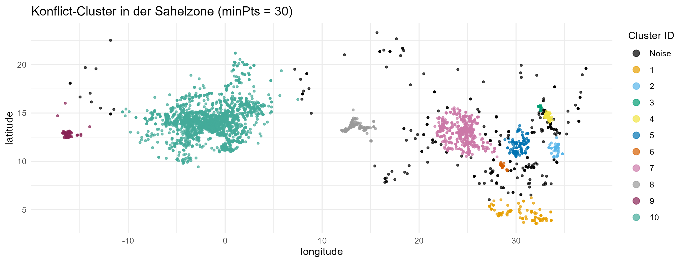
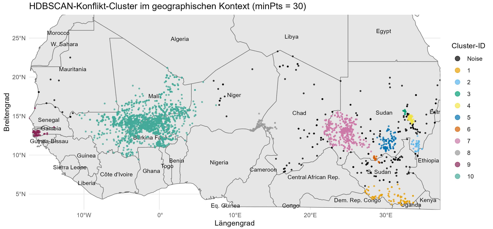
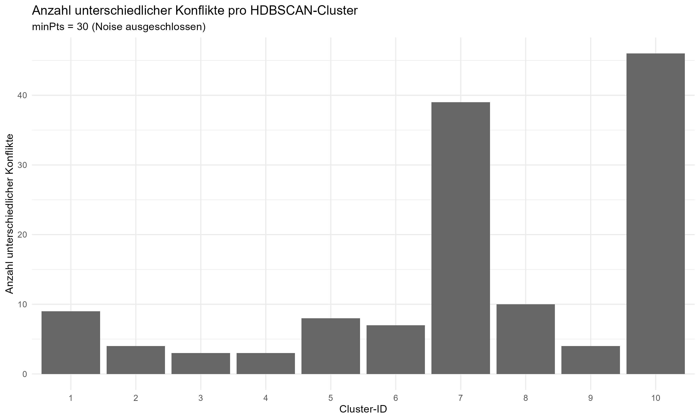
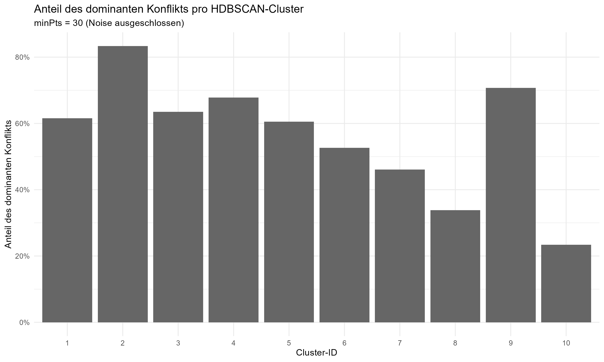

```{r setup, include=FALSE}
knitr::opts_chunk$set(
  echo = TRUE,
  warning = FALSE,
  message = FALSE
)
```

```{r, include=FALSE}
library(distill)
```


## Einleitung

Auch wenn der Kalte Krieg mehr als 30 Jahre her ist, gibt es auf der Welt weiterhin zahlreiche militärische Auseinandersetzungen. Die globale Aufrüstung wird weiter fortgeführt und die Umsätze der Rüstungsproduzenten steigen weiter an  [@sinram_weltweite_2025]. Dies mag vor allem am derzeitigen Krieg in der Ukraine und an den zahlreichen sowie andauernden Konflikten im Nahen Osten liegen, aber auch in Afrika hat sich die Zahl der Konflikte erhöht.

Auf dem afrikanischen Kontinent hat sich die Anzahl von Bürgerkriegen seit 2013 bis 2023 von 15 auf 28 fast verdoppelt [@lacher_konflikte_2025]. Trotz dieser starken Entwicklung erhalten die afrikanischen Konflikte auf der internationalen Bühne jedoch nur wenig aufmerksamkeit [@frankfurter_rundschau_kriege_2025]. In diesem Zusammenhang wird in dieser Ausarbeitung der Blick auf die Konflikte in Afrika, insbesondere auf die Sahelzone, seit dem Jahr 2000 gerichtet.

Es wird die zentrale Frage gestellt, ob auschließlich anhand der geographischen Daten von Konfliktereignissen eine zutreffende Einordnung zu den übergeordnetetn Konflikten erreicht werden kann. Die zur Beantwortung der Fragestellung verwendete Analysemethode ist hierbei ein hierarchisches dichtebasiertes Clustering. Die genutzten Daten stammen aus dem Georeferenced Event Dataset (GED) in der Version 25.1 des Uppsala Conflict Data Program (UCDP) der Universität Uppsala [@uppsala_university_department_of_peace_and_conflict_ucdp_nodate]. Die gesamte Analyse der Daten wurde in einer separaten Markdown-Datei (UCDP GED Clusteranalyse) durchgeführt, in welcher alle Auswertungen und Ergebnisse in kommentierter Form vorhanden sind, die in dieser Arbeit aufgegriffen werden. 

Die Seminararbeit ist in insgesamt sechs Kapitel unterteilt. Nach der Einleitung wird zuerst der genutzte Datensatz beschrieben und es wird auf die wichtigsten deskriptiven Zahlen des gesamten Datensatzes sowie im spezielleren auf die Daten bezüglich Afrika und der Sahelzone eingegangen. Danach werden im dritten Kapitel die Forschungsfrage und die dazugehörige Methodik erläutert, woraufhin im vierten Kapitel die Art und die Durchführung der konkreten Analysemethode erklärt wird. Im Anschluss daran werden im fünften Kapitel die Ergebnisse der Clusteranalyse vorgestellt. Zuletzt wird die gesamte Arbeit zusammengefasst sowie ein schließendes Gesamturteil getroffen.


## Vorstellung und deskriptive Beschreibung des Datensatzes

Die in dieser Arbeit verwendeten Daten stammen, wie bereits genannt, aus dem GED in der Version 25.1 des UCDP. Bei diesem Datensatz des UCDP des Department of Peace and Conflict Research der Universität Uppsala handelt es sich um eine Ansammlung von Beobachtungen zu tödlicher Gewaltt auf der Ebene von Ereignissen. Dies bedeutet, dass jede Analyseeinheit im Datensatz einem Fall organisierter Gewalt mit mindestens einem Todesopfer entspricht. Jedes Ereignis ist dabei mit mehreren räumlichen sowie zetilichen Angaben versehen, wie beispielsweise geographische Koordinaten, und besitzt unter anderem Informationen zum Konflikt [@sundberg_introducing_2013].

Kurzgefasst enthält der Datensatz demnach georeferenzierte Informationen zu einzelnen gewaltsamen Ereignissen, welche den übergeordneten Konflikten klar zugeordnet werden können. Zusätzlich sind die Namen der Konflikte sowie der beteiligten Aktuere, die aufgeschlüsselten sowie gesamten Todeszahlen und Informationen zur Datenqualität hinterlegt. Bei Letzterem handelt es sich einerseits um die Informationsklarheit des Ereignisses an sich und andererseits um die Präzision der zeitlichen Angaben [@hogbladh_ucdp_2025].

Für die vorliegende Arbeit wurde ein selbstständig gekürzter Datensatz verwendet, bei welchem mehrere nicht benötigte Variablen entfernt wurden, um die Größe der Daten insgesamt zu verringern. Die Analyse der Daten funktioniert jedoch gleichermaßen mit dem unveränderten Datensatz des UCDP. Darüber hinaus wurde der Datensatz für die Clusteranalyse eingegrenzt, weil die ursprüngliche Version des GED-Datensatzes weltweite Daten zu Konfliktereignissen über einen Zeitraum von mehreren Jahrzehnten besitzt. Um den Umfang der Analyse zu reduzieren und gleichzeitig die Fragestellung stärker einzugrenzen, wurden die Daten gefiltert und für die Analyse technisch bereinigt sowie angepasst. Es wurden beispielsweise Variablenformate verändert, wie das Festlegen der Längen- und Breitengrade als *numeric*, und Zeilen mit fehlenden geographischen Angaben entfernt, damit die spätere Clusteranalyse problemlos durchgeführt werden kann.

Für die deskriptive Begutachtung der Daten und für die Clusteranalyse wurden die Daten zudem auf Ereignisse ab dem Jahr 2000 begrenzt sowie nur Länder der Sahelzone mit einbezogen. Weitere Eingrenzungen der Daten für die Clusteranalyse werden im vierten Kapitel erläutert.

Bei den Ländern der Sahelzone handelt es sich im Kern um die Staaten Mauretanien, Mali, Burkina Faso, Niger und Tschad [@bmz_entwicklungszusammenarbeit_2025]. Zur Erweiterung der betrachteten Region wurden außerdem die Staaten Senegal und Sudan (inklusive Südsudan; im Datensatz werden unter Sudan beide Staaten zusammengefasst) mit einbezogen.

Die Daten des gesamten verwendeten Datensatzes beinhalten 1.531 Konflikte und insgesamt 385.918 Konfliktereignisse, die den Zeilen bzw. Beobachtungen entsprechen. Zudem verzeichnet der Datensatz insgesamt 3.957.143 Tote, von denen 1.474.095 zivile Todesopfer sind. Die Konflikte selbst lassen sich zudem in 201 staatliche und 967 nichtstaatliche Konflikte unterteilen. Weitere 363 Konflikte gehören zur einseitigen Gewalt gegen Zivilisten. Die Zeit der erhobenen Daten beschränkt sich dabei auf 36 Jahre im Zeitraum von 1986 bis 2024.

Bezogen auf Afrika und die Sahelzone haben sich deutlich weniger Konflikte und Todeszahlen ergeben, die trotzdem als hoch eingestuft werden können. Dieser Schluss wiegt vor dem Hintegrund, dass dabei nur die Ereignsse ab dem Jahr 2000 einbezogen wurden, umso schwerer. In Afrika wurden seit dem Jahr 2000 insgesamt 754 Konflikte mit 52.145 Ereignissen und 792.996 Toten gezählt. Mit Blick ausschließlich auf die Sahelzone sind es im selben Zeitraum 164 Konflikte, 9.282 Ereignisse und insgesamt 115.328 Tote. In beiden regionalen Bereichen waren die nichtstaatlichen Konflikte am stärksten vertreten.


## Forschungsfrage und Methodik

Der Mittelpunkt dieser Arbeit ist die Frage, ob sich aus der räumlichen Verteilung von Konfliktereignissen Rückschlüsse auf die zugrunde liegenden Konflikte des GED ziehen lassen. Es wird dabei weiterführend untersucht, ob Ereignisse desselben Konflikts auch räumlich betrachtet in ähnlichen Regionen auftreten oder ob sich die Ereignisse unterschiedlicher Konflikte in einem Cluster überlagern. Die zentrale Forschungsfrage der Arbeit wird im Folgenden ausformuliert:

**In welchem Maße entsprechen räumlich identifizierte Cluster von Konfliktereignissen in der Sahlezone den übergeordneten Konflikten, denen die Ereignisse im GED-Datensatz des UCDP zugeordnet sind?**

Zur Untersuchung dieser Fragestellung wird ein explorativer Ansatz gewählt. Ziel der Analyse ist es durch die Anwendung eines Clusterverfahrens räumliche Muster zu identifizieren, die anschließend mit den vorhandenen Konfliktinformationen des Datensatzes verglichen werden. Es ist nicht beabsichtigt eine vorab definierte Hypothese zu testen, sondern im Kern die räumliche Dimension der Konfliktdaten sichtbar zu machen.

Der Grundgedanke der Analyse besteht darin, dass Konfliktereignisse desselben Konflikts häufig innerhalb einer ähnlichen geographischen Region stattfinden. Sollten die Cluster der Konfliktereignisse häufig von einem einzelnen Konflikt dominiert werden, dann bestätigt sich diese Annahme. Im Umkehrschluss würde eine starke Durchmischung unterschiedlicher Konflikte innerhalb eines Clusters darauf hinweisen, dass räumliche Nähe alleine nicht ausreicht, um Konflikte voneinander zu unterscheiden.


## Vorstellung und Durchführung der Analysemethode

Zur Identifikation der räumlichen Muster der Konfliktereignisse wird ein dichtebasiertes Clusterverfahren verwendet. Die Kernidee des Density-Based Spatial Clustering of Applications with Noise (DBSCAN, dichtebasierte räumliche Clusteranalyse mit Rauschen) geht davon aus, dass ein Cluster eine Region im Datenraum mit hoher Dichte an Datenobjekten ist. Diese Methode des Clustering führte die Möglichkeiten ein, ohne vorherige Kenntnis der im Datensatz vorhandenen Klassen Cluster zu identifizieren und Ausreißer zu erkennen [@bushra_comparative_2021]. 

Für die Durchführung des DBSCAN müssen trotzdem Parameter festgelegt werden, auf dessen Grundlage das Clustering durchgeführt wird. Der erste Parameter *Eps* definiert den Nachbarschaftsradius und bestimmt dadurch, welche Punkte zum selben Cluster gehören. Durch den zweiten Parameter *MinPts* wird die Mindestanzahl an Punkten angegeben, die innerhalb des Radius von *Eps* erfordleich ist, damit ein Kernpunkt klassifiziert wird. Dadurch werden aus den Kernpunkten dichte Cluster, wobei die Randpunkte innerhalb von *Eps* liegen und Rauschpunkte die Dichtekriterien nicht erfüllen [@das_-depth_2025].

Im Gegensatz zu DBSCAN braucht das Hierarchical DBSCAN (HDBSCAN, hierarchisches DBSCAN), welches in der hier behandelten Analyse angewendet wird, keine Parameter für die Festlegung des Radius. Das HDBSCAN ist bezüglich des *Eps* selbstanpassend und verwendet unterschiedliche Abstände, wodurch Cluster mit verschiedenen Dichten möglich sind [@esri_density-based_nodate]. Die *MinPts* müssen jedoch, wie im letzten Schritt der Analyse zu sehen ist, festgelegt werden.

Die Analyse wurde vollständig mit der Statistiksoftware R in der Entwicklungsumgebung RStudio durchgeführt. Zur Trennung zwischen Ausarbeitung des Themas und Analyse der Daten wurden, wie bereits in der Einleitung beschrieben, zwei R-Markdown-Dateien verwendet. Diese Arbeit bezieht sich dabei auf die durchgeführte Analyse und den kommentierten Code der Analysedatei. Außerdem integriert sie die Abbildungen und Diagramme der Clusteranalyse in den Ergebnisteil der Arbeit.

Für das Schreiben des Codes und für die Analyse wurden mehrere R Pakete verwendet, welche die Basisfunktionen von R ergänzen. Die Pakete *lubridate*, *dplyr* und *tidyr* wurden vorrangig für die Datenaufbereitung sowie Datenfilterung verwendet, wohingegen die Pakete *sf* und *dbscan* für die Kartenprojektion sowie die eigentliche Clusteranalyse genutzt wurden. Bei den Paketen *ggplot2*, *rnaturalearth* und *rnaturalearthdata* handelt es sich um Pakete für die Darstellung von Diagrammen, wobei *rnaturalearth* für die Erstellung einer Karte innerhalb eines Diagramms verwendet wurde. Das Paket *distill* dient dazu den Code der Datei in eine ansprechende HTML-Webseite umzuwandeln.

Der Ablauf der Analyse lässt sich in mehrere aufeinanderfolgende Schritte und Codechunks unterteilen. Diese werden in den folgenden Abschnitten beschrieben und anhand der eingefügten, aber funktionslosen, Codeblöcke erklärt.

Zusammengefasst besteht die komplette Analyse aus vier Kernschritten. Die vorangegangene Bereinigung sowie Anpassung der Daten und die sich anschließende Auswertung sowie Generierung der Diagramme zählt nicht in diese Abfolge mit rein.

Zuerst wurden die Daten für die Clusteranalyse nach mehreren Kriterien eingegrenzt. Daran anschließend wurden die Ereignisse in ein räumliches Datenformat überführt. Daraufhin wurde eine Kartenprojektion definiert und die Koordinaten in dieses metrische Koordinatensystem eingebettet. Zuletzt wurde auf dieser Grundlage das Clusterverfahren durchgeführt.

**Eingrenzung der Daten**

```{r, eval=FALSE}

sahel_countries <- c("Senegal",
                     "Mauritania",
                     "Mali",
                     "Burkina Faso",
                     "Niger",
                     "Chad",
                     "Sudan")

GED_sahel <- GED |>
  filter(country %in% sahel_countries) |>
  filter(year >= 2000) |>
  filter(where_prec %in% c(1, 2)) |>
  filter(event_clarity == 1)

```

Im ersten Schritt der Clusteranalyse wurden die Daten eingegrenzt. Da sich die Analyse nur auf die Länder der Sahelzone bezieht, wurden diese sieben Länder mit einem definierten Vektor festgelegt. Des Weiteren wurden nur Ereignisse einbezogen die einschließlich nach dem Jahr 2000 geschehen sind. Außerdem wurde die Datenqualität berücksichtigt, indem nur Beobachtungen Einzug in die Analyse fanden, wo die Präzision des Orts und die Klarheit bezüglich der Ereignisse sehr gut ist. Es handelt sich bei diesem Schritt demnach um die Definition der Grundgesamtheit für das Clusterverfahren.

**Erstellung geometrischer Punkte**

```{r, eval=FALSE}

GED_sahel_sf <- GED_sahel |>
  st_as_sf(
    coords = c("longitude", "latitude"),  # x = longitude, y = latitude
    crs = 4326,                           # WGS84 / EPSG:4326 (Grad)
    remove = FALSE                        # Datensatz behält latitude/longitude als Spalten
  )

```

Der zweite Schritt der Analyse besteht aus der Überführung der geographischen Daten (Längen- und Breitengrade) der Konfliktereignisse in ein räumliches Datenformat. Hierzu wurde das R Paket *sf* verwendet. Dieses Paket eröffnet den Zugriff auf Simple Features (SF), bei denen es sich um eine standardisierte Methode zur Kodierung und Analyse von Vektordaten handelt [@pebesma_sf_2026].

Im Code werden die geographischen Daten nun in ein SF-Objekt umgewandelt. Der definierte Vektor *coords* greift auf die im Datensatz vorhandenen Werte zu den Längen- und Breitengraden zu, um diese dann über das Coordinate Reference System (CRS) mit der Nummer 4326 als geometrische Punkte zu definieren. Das CRS 4326 steht hierbei für das World Geodetic System 1984 (WGS84), welches das am häufigsten verwendete geographische Koordinatensystem auf der Welt ist und auf dem GPS-Messungen basieren [@esri_wgs84_nodate]. Im nächsten Schritt wird auf die im SF-Objekt gespeicherten Koordinatenpunkte zugegriffen.

**Definition der Kartenprojektion**

```{r, eval=FALSE}

crs_laea_sahel <- "+proj=laea +lat_0=15 +lon_0=10 +datum=WGS84 +units=m +no_defs"


GED_sahel_laea <- GED_sahel_sf |>
  st_transform(crs = crs_laea_sahel)


coords_m <- st_coordinates(GED_sahel_laea)


GED_sahel_laea <- GED_sahel_laea |>
  mutate(
    x_m = coords_m[, 1],
    y_m = coords_m[, 2]
  )

```

In diesem Schritt wurde die Kartenprojektion erstellt. Diese ist die Grundlegend für die anschließende Clusteranalyse, da sie mit den Daten dieser Projektion durchgeführt wird. Der Zweck liegt darin, dass die Koordinaten für eine Distanzanalyse innerhalb eines metrischen Koordinatensystems voliegen müssen, damit die Entfernungen korrekt berechnet werden können. Bei geographischen Daten, wie die Längen- und Breitengrade, werden keine konstanten Distanzen dargestellt. Diesbezüglich ist dieser Teil der Analyse nochmals in drei Teilschritte unterteilt.

Zuerst wird ein Koordinatenreferenzsystem auf Grundlage der Lambert Azimuthal Equal-Area (LAEA) Projektion definiert. Die LAEA-Projektion bewahrt die tasächlichen relativen Größenverhältnisse der Landmassen. Hierbei wird die Welt von einem beliebigen Punkt auf dem Globus auf eine ebene Fläche projiziert [@esri_lambert_nodate].

Da es sich bei diesem Koordinatensystem um eine flächentreue (equal-area) Projektion handelt, besitzt diese Abbildung einen konstanten Flächenmaßstab [@steinert_flachentreue_nodate]. Die Abstände in diesem System können demnach als metrisch kategorisiert werden, was weitere Berechnungen, wie das Clustering, ermöglicht. Das Projektionszentrum wurde bei 15 Grad nördlicher Breite und 10 Grad östlicher Länge gesetzt, weil dieser Punkt ungefähr im Zentrum der Sahelzone liegt. Dadurch sollen räumliche Verzerrungen reduziert werden.

Im nächsten Teilschritt werden die Daten aus dem WGS84-Koordinatensystem (Grad) in die neu erstellte LAEA-Projektion (Meter) transformiert. Daran anschließend werden im dritten Teilschritt die projizierten Koordinaten aus der Geometrie extrahiert und in *coords_m* abgespeichert. Dadurch kann im nächsten Schritt auf diese nun metrischen Daten wieder zugegriffen werden und die Entfernungen zwischen den Ereignispunkten können korrekt berechnet werden.

**Clusteranalyse**

```{r, eval=FALSE}

minPts_value <- 30


hdb <- hdbscan(coords_m, minPts = minPts_value)


GED_sahel_laea <- GED_sahel_laea |>
  mutate(
    cluster_id = hdb$cluster,
    cluster_prob = hdb$membership_prob
  )

```

Der vierte und letzte Schritt der Analyse ist nun die angepeilte Clusteranalyse nach dem HDBSCAN-Verfahren. Für die Durchführung des Clusterings wurde, wie bereits genannt, das R Paket *dbscan* verwendet. Dieses bietet mehrere dichtebasierte Algorithmen mit Schwerpunkt auf der DBSCAN-Familie [@hahsler_r_2025].

Vor der Durchführung des Verfahrens wurden zuerst die *MinPts* festgelegt. Hierbei wurde ein Wert von 30 Punkten angepeilt, um stabile Cluster in verschiedenen Größen zu erhalten und gleichzeitig zufällige Dichtemuster zu ignorieren.

Daraufhin wurde mit dem definierten Parameter der *MinPts* und den zuvor projizierten Koordinaten, die in *coords_m* abgespeichert sind, das Clustering durchgeführt. Die Anzahl der Cluster wird dabei vom Algorithmus automatisch bestimmt und mit einer Zahl benannt (*cluster_id*). Zusätzlich wird angegeben, wie stabil bzw. sicher ein Punkt einem Cluster zugeordnet ist (*cluster_prob*). Zuletzt werden diese neu gewonnenen Daten in den Datensatz mit allen anderen Variablen integriert (*GED_sahel_laea*).

Im Anschluss an die Analyse wurden mehrere Auswertungsschritte durchgeführt. Zunächst wurde die räumliche Verteilung der identifizierten Cluster kartographisch dargestellt. Daraufhin wurde untersucht, wie viele unterschiedliche Konflikte innerhalb eines Clusters auftreten und welcher Konflikt jeweils den größten Anteil innerhalb eines Clusters ausmacht. Die Ergebnisse werden im nächsten Kapitel anhand mehrerer Diagramme beschrieben.


## Ergebnisse der Clusteranalyse

Die Anwendung des HDBSCAN-Verfahrens auf die geographischen Daten der Konfliktereignisse führte zur Identifikation von insgesamt 10 räumlichen Clustern. Zusätzlich wurden insgesamt 4,88 % der Punkte bzw. Ereignisse vom Algorithmus als sogenannte Noise-Punkte klassifiziert, die zu keinem Cluster gehören. Es wurden demnach über 90 % der Punkte einem Cluster konkret zugeordnet.

Darüber hinaus kann festgehalten werden, dass sich die insgesamte Qualität der Clusteranalyse in einem guten Bereich befindet. Zusätzlich zum geringen Noise-Anteil der Punkte ist die Stabilität der meisten Punkte sehr gut. Die in der Analyse als *membership_prob* bzw. *cluster_prob* bezeichnete Variable gibt hierbei die Wahrscheinlichkeit bzw. die Stabilität der Punkte innerhalb eines Clusters an [@rdocumentation_hdbscan_nodate]. Diese liegt im Durchschnitt bei 77 %. Daraus kann geschlossen  werden, dass die Punkte der Clusteranalyse auch bei strengeren Bedingungen der Analyse im Cluster bleiben und die räumliche Struktur klar ist.

Die Cluster werden in den beiden ersten Diagrammen anhand der Längen- und Breitengrade dargestellt, um sie mit einer Karte von Nordafrika verbinden zu können. Dabei zeigen die Diagramme die Konfliktereignisse als Punkte im geographischen Raum. Zur Unterscheidung werden die Ereignisse desselben Clusters jeweils in derselben Farbe dargestellt. Für die Einfärbung der Cluster bzw. Punkte wurde die Farbpalette nach Okabe und Ito [@okabe_color_2002] ausgewählt, um eine farbliche Differenzierung auch für Farbenblinde zu ermöglichen. Da diese Palette jedoch nur sieben unterschiedliche Farben angibt, wurden drei weitere Farben hinzugefügt, welche sich an je einer Farbe der Palette orientieren. In Abbildung 1 sind die Punkte in einem leeren Koordinatensystem der Gradzahlen angegeben, wohingegen in Abbildung 2 unter die Punkte der Cluster eine Karte von Nordafrika gelegt wurde, damit die Cluster einfacher räumlich einzuordnen sind. Punkte, die als Noise eingestuft wurden, sind schwarz dargestellt.

::: {.l-screen}
<div style="width:70%; margin:auto;">



<p style="margin-top:0px; font-size:1.0em;">
Abbildung 1: Konflikt-Cluster mit Längen- und Breitengraden
</p>

</div>
:::

Die Abbildung 1 zeigt die identifizierten Cluster ausschließlich auf Grundlage der Längen- und Breitengrade der Ereignisse. In der Darstellung lassen sich mehrere deutlich voneinander abgegrenzte Konfliktzonen und -zentren innerhalb der Sahelzone erkennen. Einige dieser Cluster umfassen eine große Anzahl an Ereignissen und erstrecken sich über größere Teile der Region. Dahingegen sind andere Cluster deutlich kleiner und räumlich stärker konzentriert.

::: {.l-screen}
<div style="width:70%; margin:auto;">



<p style="margin-top:0px; font-size:1.0em;">
Abbildung 2: Konflikt-Cluster über einer Karte von Nordafrika
</p>

</div>
:::

Zur besseren räumlichen Einordnung der Cluster zeigt die Abbildung 2 zusätzlich eine Karte des afrikanischen Kontinents, die passend zu den Längen- und Breitengraden unter die Cluster gelegt wurde. Dadurch werden verschiedene Aspekte hervorgehoben. Es wird sichtbar, wo sich die Länder der Sahelzone befinden und wie groß die räumliche Ausdehnung der Cluster im Verhältnis zum Kontinent ist. Außerdem ist zu erkennen, wo genau sich die Cluster befinden und an welchen Ländergrenzen sich diese aufhalten.

Bei Betrachtung der beiden Abbildungen fallen die beiden größten Cluster Nummer 7 und 10 auf. Das Cluster 7 hat insgesamt 1.356 Ereignisse zugeordnet bekommen, während das Cluster 10 mit 3.378 Ereignissen mehr als doppelt so groß ist. Zudem ist dieses Cluster augenscheinlch auch bezogen auf die Ausdehnung am größten. Alle anderen Cluster befinden sich in einem Bereich von 54 bis 340 Ereignispunkten.

Besonders auffällig ist das große Cluster 10, welches sich über Teile von Mali, Burkina Faso und Niger ausbreitet. Das Cluster 7 ist im Gegensatz nur im Westen des Sudans angesiedelt und hat scheinbar die Grenze zu Tschad als Begrenzung der Ereignisse. Daneben gibt es jedoch auch zahlreiche stark konzentrierte Cluster, wie das CLuster 9 bei Senegal und das Cluster 6 an der südlichen Landesgrenze vom Sudan. Bemerkenswert sind zudem die Cluster 8 und 1, die sich an mehreren Landesgrenzen entlang bewegen.

Anhand der nächsten Diagramme wird ersichtlich, wie homogen oder heterogen die Cluster sind. Dies gibt Aufschluss darüber, inwiefern sich das Clustering zur geopraphischen Identifikation von Konflikten eignet.

::: {.l-screen}
<div style="width:50%; margin:auto;">



<p style="margin-top:0px; font-size:1.0em;">
Abbildung 3: Anzahl übergeordneter Konflikte je Cluster
</p>

</div>
:::

Neben der räumlichen Verteilung wurde auch die Zusammensetzung der Cluster bezüglich der übergeordneten Konflikte untersucht. Dazu wurde einerseits ausgewertet, wie viele unterschiedliche Konflikte innerhalb eines Clusters auftreten, und andererseits wurden die Anteile des dominanten Konflikts je Cluster dargestellt. Diese beiden Informationen werden in Abbildung 3 und Abbildung 4 jeweils in einem Säulendiagramm abgebildet.

Es hat sich bei der Anzahl der Konflikte pro Cluster ein differenziertes Bild gezeigt. Während einige Cluster nur wenige unterschiedliche Konflikte enthalten, weisen andere Cluster eine deutlich höhere Konfliktvielfalt auf. Auffallend sind hierbei die beiden größten Cluster der Analyse. Die Cluster 7 und 10 besitzen mit jeweils ungefähr 40 Konflikten eine sehr heterogene Zusammensetzung und enthalten die höchste Anzahl an unterschiedlichen Konflikten.

Im Gegensatz dazu bestehen die anderen Cluster, die von ihrer Größe her nicht an die Cluster 7 und 10 heranreichen, aus deutlich weniger unterschiedlichen Konflikten. Dies deutet darauf hin, dass sich in diesen Regionen Ereignisse stärker auf einzelne Konflikte konzentrieren.

::: {.l-screen}
<div style="width:50%; margin:auto;">



<p style="margin-top:0px; font-size:1.0em;">
Abbildung 4: Anteil des dominaten Konflikts je Cluster
</p>

</div>
:::

Ein genaueres Bild bezüglich der Zusammensetzung der Cluster ergibt sich durch die Betrachtung des sogenannten Dominanzanteils eines Konflikts innerhalb eines Clusters. Dieser Anteil gibt an, welchen Prozentsatz der am häufigsten vorkommende Konflikt eines Clusters an der Gesamtanzahl der Ereignisse ausmacht. Die entsprechenden Werte sind in der Abbildung 4 dargestellt.

Anhand des Diagramms lässt sich erkennen, dass einige Cluster eine relativ hohe Dominanz und somit auch eine stärkere Homogenität aufweisen. Besonders deutlich wird dies bei Cluster 2, bei dem mehr als 80 % der Ereignisse auf einen einzigen Konflikt zurückzuführen sind. Auch das Cluster 9 besitzt mit knappen 70 % einen hohen Dominanzanteil. Es kann bei einem Vergleich der beiden Säulendiagramme außerdem festgehalten werden, dass Cluster mit weniger als 10 unterschiedlichen Konflikten einen Dominanzanteil von über 50 % besitzen.

Andere Cluster weisen hingegen eine deutlich geringere Dominanz eines einzelnen Konflikts auf. Der Dominanzanteil bei Cluster 10 liegt beispielsweise nur bei etwa 25 %. In diesen Fällen verteilen sich die Ereignisse demnach auf eine größere Anzahl unterschiedlicher Konflikte, wodurch diese Cluster eine heterogenere Struktur aufweisen.

Es verbleibt in diesem Zusammenhang die Frage, um welchen identifizierten dominanten Konflikt es sich vor allem bei den homogenen Clustern handelt. Bei dem Cluster 9 mit dem zweithöchsten Dominanzanteil wurde der Konflikt "Senegal: Casamance" identifiziert. Der häufigste Konflikt des Cluster 2 ist der Konflikt "Sudan: Government", wobei hier aufgezeigt werden muss, dass die Cluster 3, 5 und 7 denselben dominanten Konflikt besitzen. Dieser Konflikt scheint demnach in unterschiedliche Hotspots aufgeteilt zu sein. Die Cluster 1 und 4 besitzen jedoch beide jeweils einen dominanten Konflikt, der bei den anderen Clustern nicht den häufigsten Konflikt darstellt.

Die Kombination der beiden Auswertungen zeigt, dass sich räumliche Cluster von Konfliktereigissen teilweise stark mit einzelnen Konflikten decken, während andere Cluster mehrere Konflikte innerhalb desselben geographischen Raums erfassen. Insbesondere größere Cluster tendieren dazu, mehrere Konflikte zu enthalten. Demgegenüber werden räumlich kleinere Cluster häufiger von einzelnen Konflikten dominiert. Insgesamt deutet die Analyse darauf hin, dass geographische Nähe ein wichtiger Faktor für die Abgrenzung von Konflikten sein kann, jedoch alleine nicht ausreichend ist. Diese Schlussfolgerung wird dadurch unterstützt, dass manche Cluster denselben dominanten Konflikt vorweisen.


## Zusammenfassende Schlussbetrachtung

Das Ziel dieser Arbeit war es zu untersuchen, in welchem Maß sich Konflikte innerhalb der Sahelzone allein anhand der geographischen Verteilung von Konfliktereignissen voneinander abgrenzen lassen. Zu diesem Zweck wurde eine dichtebasierte Clusteranalyse nach dem HDBSCAN-Verfahren auf Grundlage der geographischen Koordinaten der Ereignisse aus dem GED des UCDP der Universität Uppsala durchgeführt.

Die Ergebnisse zeigen ein insgesamt ausgeglichenes Bild bezüglich der Cluster. Einerseits konnten einzelne Cluster identifiziert werden, in denen ein übergeordneter Konflikt einen großen Anteil der Konfliktereignisse ausmacht. Diese Cluster weisen eine eher homogene Struktur auf und deuten darauf hin, dass bestimmte Konflikte tatsächlich stark räumlich konzentriert auftreten. Andererseits zeigen vor allem größere Cluster eine deutlich heterogenere Zusammensetzung auf, in denen mehrere verschiedene Konflikte gleichzeitg vertreten sind.

Die Analyse verdeutlicht somit, dass eine Eingrenzung und Zuordnung von Konfliktereignissen ausschließlich anhand geographischer Daten nur teilweise möglich ist. Zwar stellt räumliche Nähe einen wichtigen Hinweis auf die Zugehörigkeit von Konfliktereignissen dar, sie reicht aber nicht aus, um Konflikte eindeutig voneinander zu unterscheiden.

Gleichzeitig weist die vorliegende Untersuchung mehrere Limitationen auf. Zum einen umfasst der betrachtete Zeitraum mehr als zwei Jahrzehnte, innerhalb dessen sich Konfliktdynamiken erheblich verändern können. In vielen Regionen treten wahrscheinlich unterschiedliche bewaffnete Akteure über einen größeren Zetraum auf, die um ähnliche territoriale oder strategische Ziele kämpfen. Dadurch können sich Ereignisse verschiedener Konflikte räumlich überlagern. Außerdem wurden in der vorliegenden Analyse weder die Art des Konflikts noch die beteiligten Parteien berücksichtigt, obwohl diese einen wichtigen Einfluss auf die Struktur von Konflikten haben können.

Für zukünftige Analysen ergeben sich daraus mehrere mögliche Erweiterungen. Eine Untersuchung mit einem kürzeren Betrachtungszeitraum könnte helfen, zeitliche Überlagerungen verschiedener Konflikte zu reduzieren. Zudem wäre es sinnvoll, die beteiligten Konfliktparteien oder genaue Konflikte stärker in die Analyse einzubeziehen, um räumliche Muster besser interpretieren zu können.

Darüber hinaus können sich die räumlichen Muster von Konflikten in Zukunft stärker verändern. Der im Allgemeinen zunehmende Einsatz weitreichender Waffensysteme wie Raketen, Marschflugkörper oder Drohnen kann dazu führen, dass Konfliktereignisse räumlich stärker verteilt auftreten. Ob sich jedoch eine solche Entwickluing auch auf die momentanen Konflikte in Afrika übertragen lässt, bleibt offen und müsste in zukünftigen Untersuchungen weiter verfolgt werden.


# Anhang {.appendix .unnumbered toc=false}

In dieser Arbeit wurde die APA-Zitierweise genutzt.

Jegliche URL- und DOI-Links der Quellen wurden am 17.03.2026 zuletzt aufgerufen und überprüft. Es wird bestätigt, dass die im Literaturverzeichnis aufgelisteten Webadressen zu diesem Zeitpunkt im Internet auffindbar waren. Der Zugriff auf entgeltlich zu erwerbende Quellen wurde über das Netz der Universität ermöglicht.

Die Web-Adresse für den Download des Datensatzes (UCDP Georefernced Event Dataset Global Version 25.1) lautet: https://ucdp.uu.se/downloads/

Der Datensatz wurde als Excel-Datei heruntergeladen und dann in eine CSV-Datei umgewandelt. Der Zugriff auf die Daten über R Studio ließ sich nur so gewährleisten. Als Trennzeichen wurde das Semikolon festgelegt.

Bei der Erstellung dieser Ausarbeitung wurden KI-Anwendungen zur Einarbeitung in R Studio, Unterstützung bei der Programmierung des Codes in R, inhaltlichen Diskussion, sprachlichen Optimierung und Übersetzung von fremdsprachigen Quellen genutzt. Dabei handelt es sich um die KI-Modelle „ChatGPT“ von OpenAI und „DeepL“.

# Kursinformationen {.appendix .unnumbered toc=false}

Name: Simon Teichgräber

Matrikelnummer: 1229726

Studiengang: HRM 2022

Modul: Business Analytics mit R 

Dozent: Prof. Dr. Uwe Messer

Trimester: WT 2026

Beginn der Erstellung. 19.02.2026

Abgabetag der Arbeit: 20.03.2026
